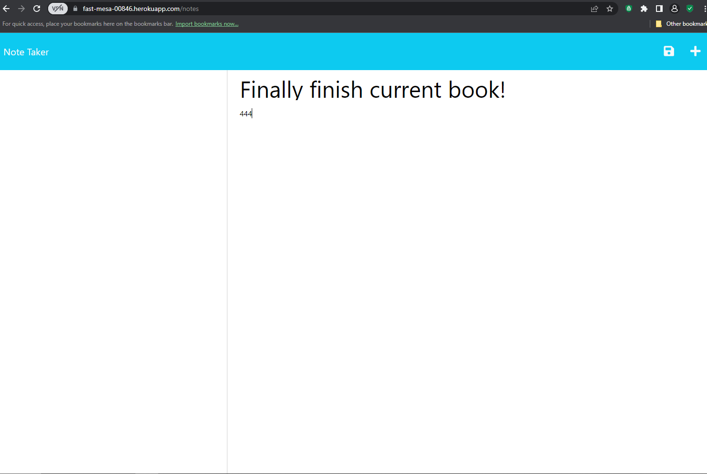

## Just-a-Note-Taker

[](https://opensource.org/licenses/MIT)

A Note Taker.


## Description

This is a Note Taker application that is used to write and save notes. This application will use an Express.js Back-end and will save and retrieve note data from a JSON file. The Front-end was already created. The Back-end was then made by me.


## User Story

AS A small business owner
I WANT to be able to write and save notes
SO THAT I can organize my thoughts and keep track of tasks I need to complete


## Installation

To use this application install:
```
npm install
npm start
http://localhost:3000/ on browser
Then, deploy on Heroku
```


## Visual 

<h2 align="center">
Note Taker Application Start Screenshot:
</h2>




## Links

[GitHub Repo](https://github.com/kitkatt17/Just-a-Note-Taker)

Deployed Heroku Link: https://fast-mesa-00846.herokuapp.com/


## License

[](https://opensource.org/licenses/MIT)

[MIT License](https://opensource.org/license/mit-0/)

For the full text of this license, please click on the link provided.